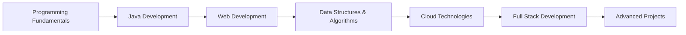

<!-- View Counter -->

<h1 align="center">
  
</h1>

  

###

Hey there! Welcome to my GitHub profile. I'm <strong>Katika Sahil</strong> 👋, a passionate tech enthusiast exploring development, learning new technologies, and collaborating on exciting projects! 🚀

###

<h2 align="left">🚀 About Me ✨</h2>

###

###

<h5 align="left">🔭 Currently working on Java & Web Development Projects 🌱 Learning DSA, Python, and cloud technologies 👯 Looking to collaborate on open-source projects 🤝 Always excited to learn from the community 💬 Ask me about Java, web development, or coding challenges ⚡ Fun fact: I love solving coding problems and building cool stuff! ☕💻</h5>

###

## 📚 Learning Journey

###

<h2 align="left">💻 Skills & Technologies 🔥</h2>

###

  
  
  
  
  
  
  
  
  

###

## 🛠️ Tech Stack & Tools

  

  
  
  
  
  
  
  
  

## 💻 Extended Tech Stack:

### Programming Languages

### Development Tools & Platforms

### Databases

### Cloud & Learning

###

<h2 align="left">Let's Connect! 🌐</h2>

###

  
  
  

###

<h2 align="center">⚡ GitHub Stats ⚡</h2>
 

  

    
    
  

           
  

    
  

  
   
  

    
  

  
   
   
   

###

<h2 align="center">📈 Contribution Activity</h2>

  

  
### 🌊 GitHub Activity Flow

###

  <h2>🚀 My Contributions 🚀</h2>
   
  
  <picture>
    <source media="(prefers-color-scheme: dark)" srcset="https://raw.githubusercontent.com/sahi-sahils/sahi-sahils/output/github-contribution-grid-snake-dark.svg" />
    <source media="(prefers-color-scheme: light)" srcset="https://raw.githubusercontent.com/sahi-sahils/sahi-sahils/output/github-contribution-grid-snake.svg" />
    
  </picture>
  
   
   
   

###

<h2 align="center">🏆 Trophies 🏆</h2>

  

###

## 🎯 Current Focus Areas

- **☕ Java Development**: Building robust applications and exploring advanced concepts
- **🌐 Web Development**: Full-stack development with modern technologies
- **📊 Data Structures & Algorithms**: Mastering problem-solving and competitive programming
- **☁️ Cloud Technologies**: Learning cloud platforms and deployment strategies
- **🤝 Open Source**: Contributing to open-source projects and communities

---

<h4 align="center">
  <a href="https://github.com/sahi-sahils?tab=repositories" title="Show Repositories">🔎 Show More 🔍</a>
</h4>

---

  <h3>⭐ Don't forget to star my repositories if you find them interesting! ⭐</h3>
  
  
  
    
  
  <i>Happy Coding! 😊</i>
  
   
  
  <i>Made with ❤️ by Sahil</i>

---
